# Rust Tutorial

## Initializing a project locally

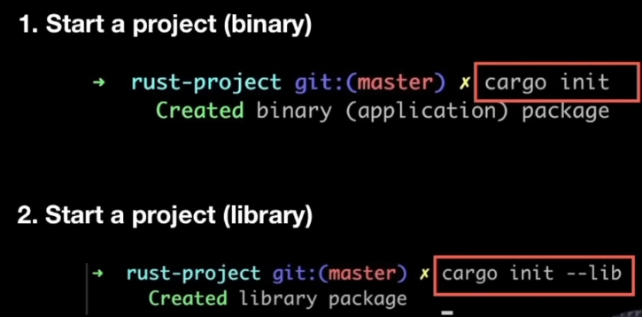

## Variables, Conditionals, Loops and Functions


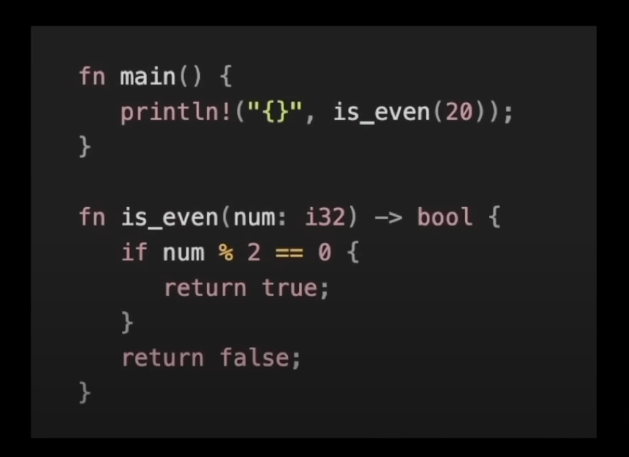

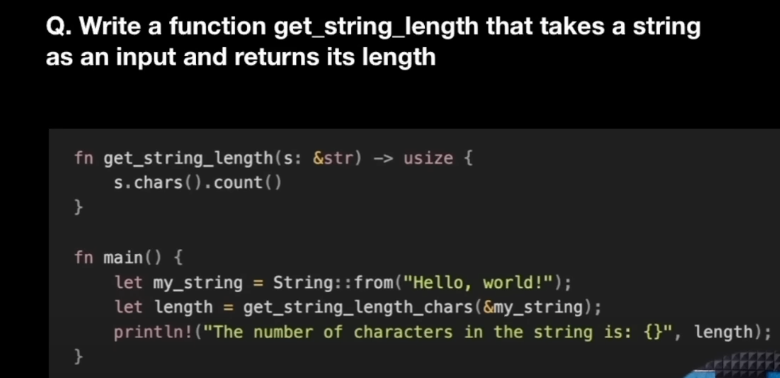

## Structs

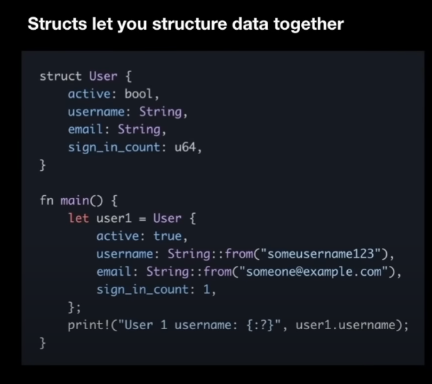

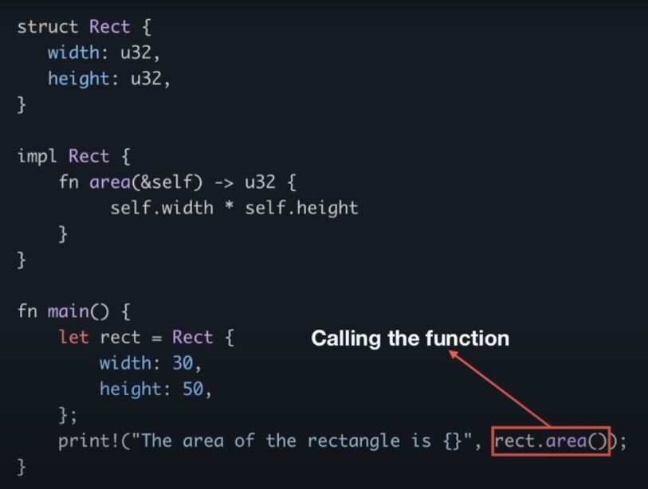

## Enums

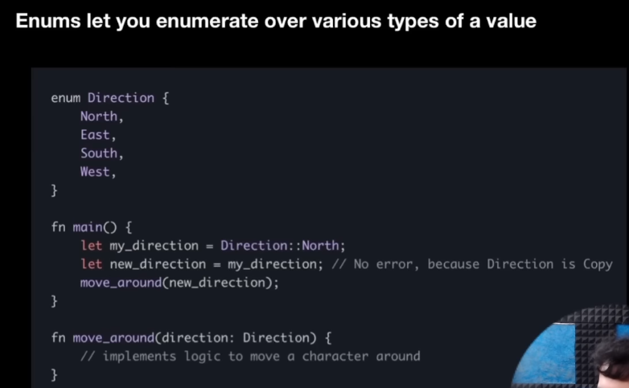

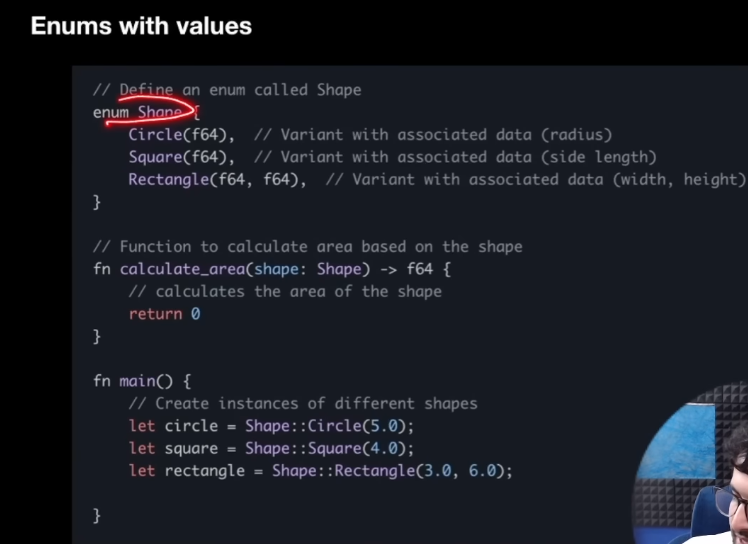

## Pattern Matching

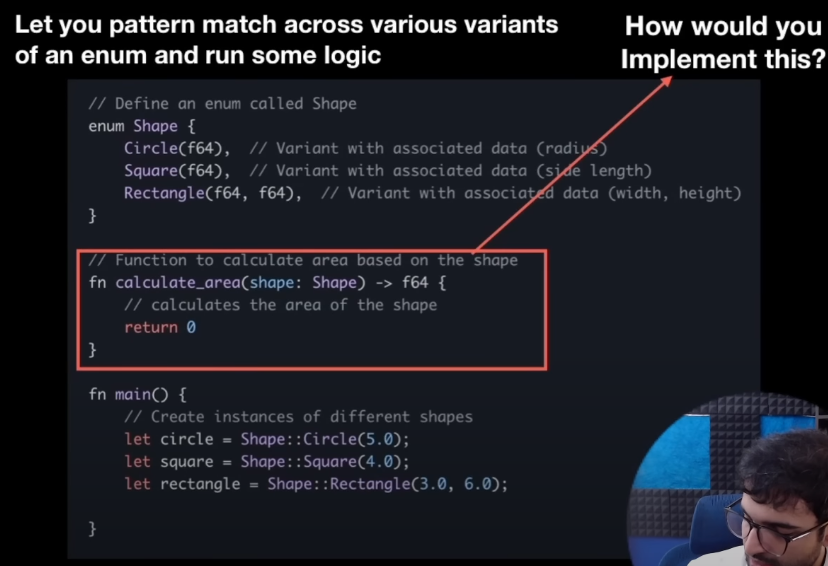

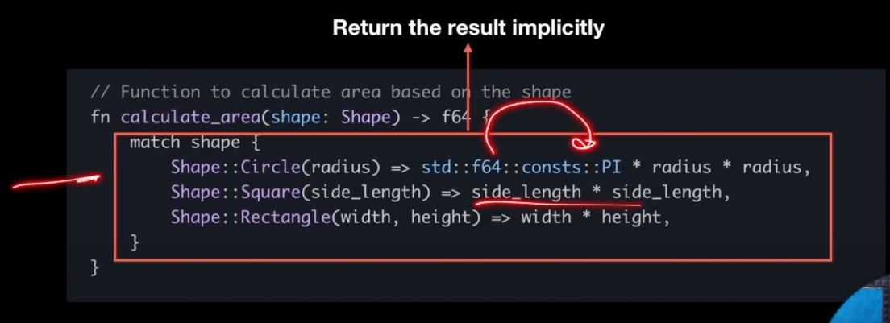

## Option Enum


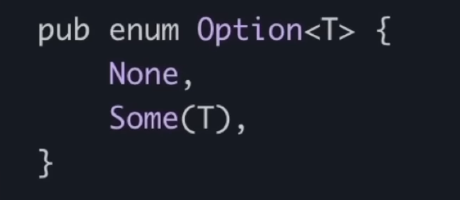

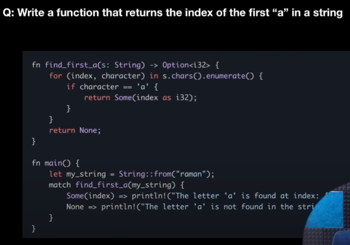

## Result Enum

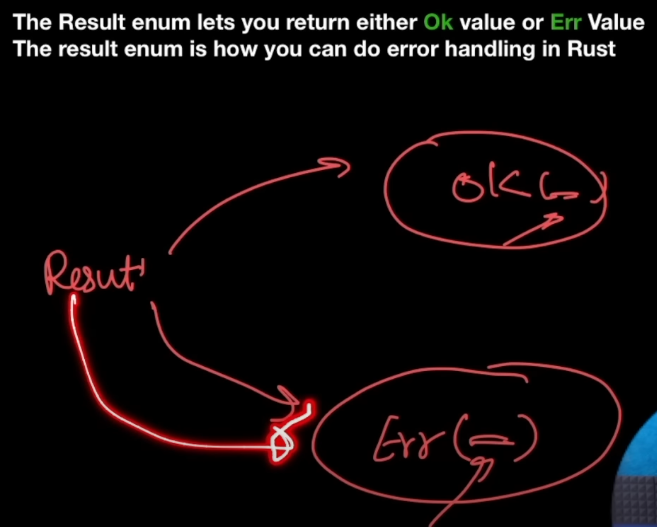


## Package Management in Rust


## Memory Management in Rust

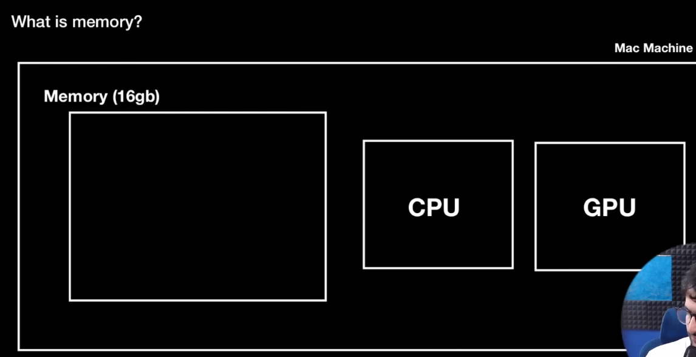


When a program runs it is reserved some static memory and during the execution it also keeps asking for some dynamic memory.

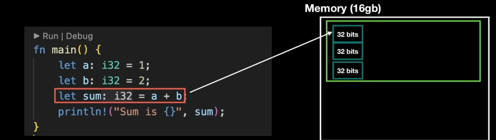

## Heap vs Stack

The ```static size``` variables that are identified during compile time are stored inside a ```stack```.

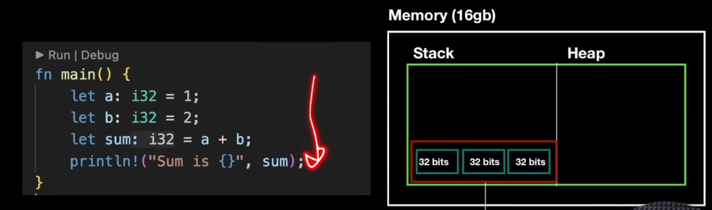

When a function runs, its ```stack frame``` is pushed into the stack and is popped off when its execution gets completed and the memory is freed.

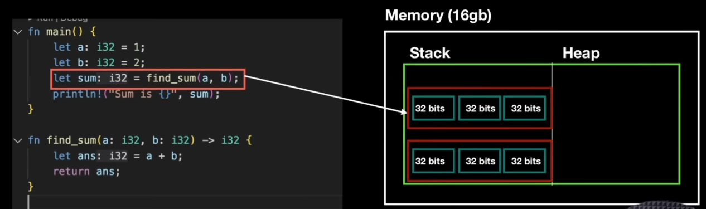

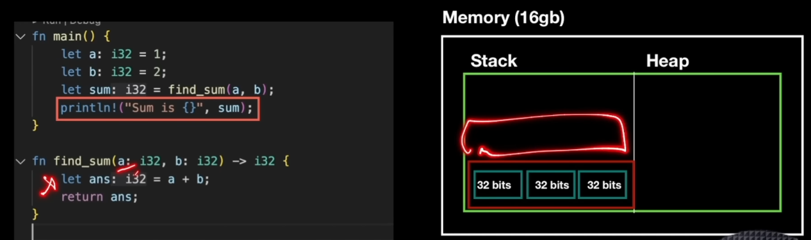

The ```variables whose size could be changed``` during runtime are stored in the ```heap```.

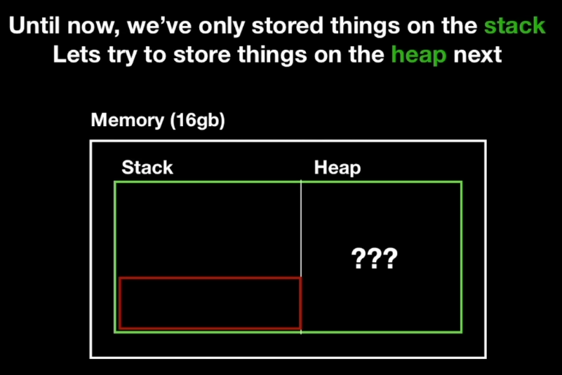

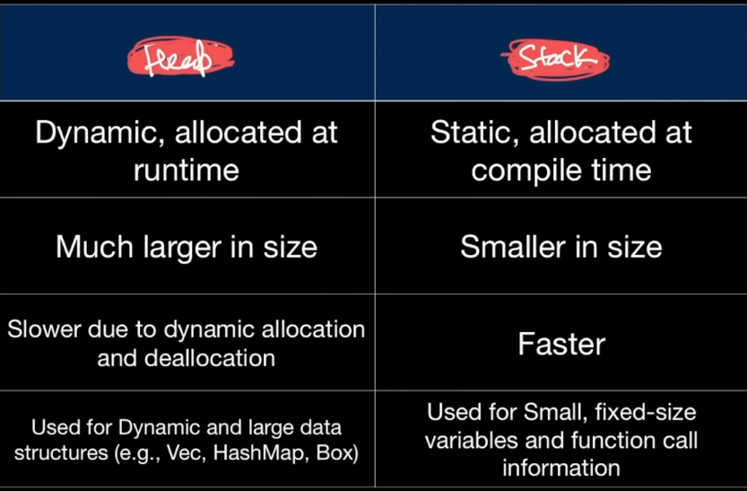

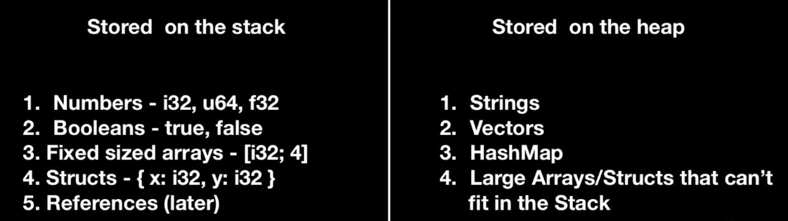

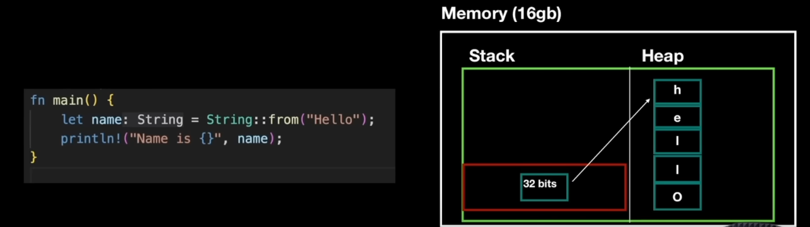

> For all the dynamic sized data that's stored on the heap, the corresponding metadata like identifiers (whose size doesn't change) is stored on the stack along the with a ```pointer``` to the data in the heap.


## Mutability

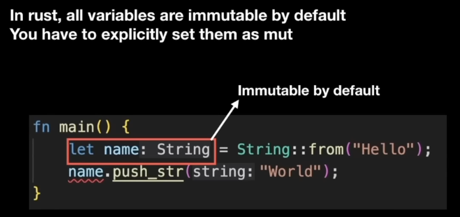

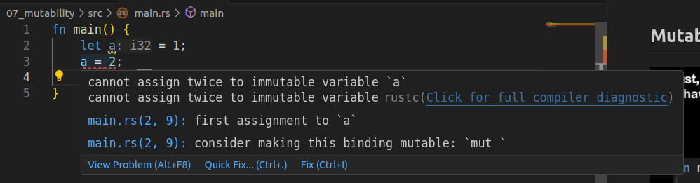

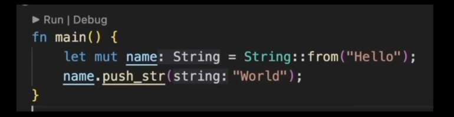
