# Rust Tutorial

## Initializing a project locally


## Variables, Conditionals, Loops and Functions


## Structs


## Enums


## Pattern Matching


## Option Enum


## Result Enum


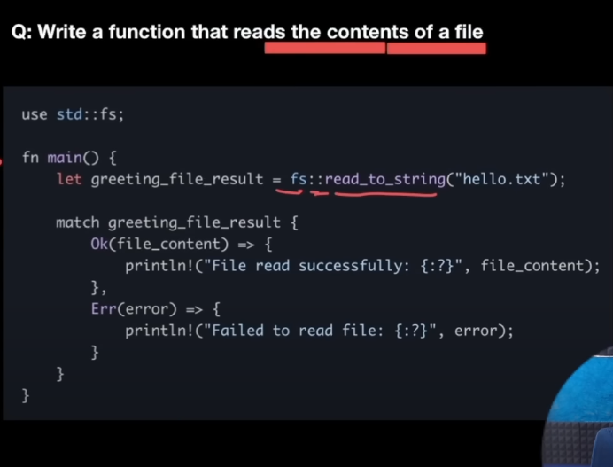

## Package Management in Rust


## Memory Management in Rust


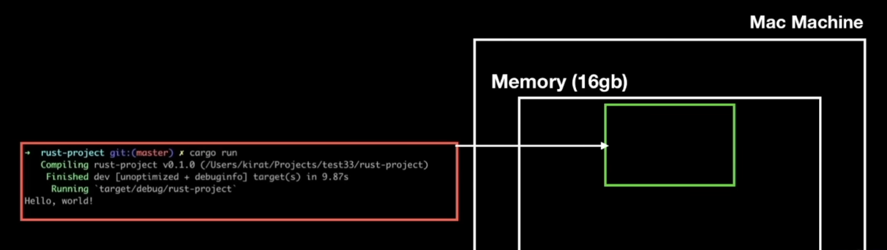

When a program runs it is reserved some static memory and during the execution it also keeps asking for some dynamic memory.


## Heap vs Stack

The ```static size``` variables that are identified during compile time are stored inside a ```stack```.


When a function runs, its ```stack frame``` is pushed into the stack and is popped off when its execution gets completed and the memory is freed.


The ```variables whose size could be changed``` during runtime are stored in the ```heap```.


> For all the dynamic sized data that's stored on the heap, the corresponding metadata like identifiers (whose size doesn't change) is stored on the stack along the with a ```pointer``` to the data in the heap.


## Mutability


## Ways of memory management in different languages

Memory management is the process of allocating and deallocating the memory based on the functions that are being executed.


In the above example, the memory leak happens since the memory is not deallocated after the function execution is finished.


### The Rust way


Rust handles the cleaning up of the heap by itself when the stack frame of a function is cleared.

> In Rust, a value can't exist on the heap if it doesn't have a reference on the stack.

## Ownership

### Ownership rules

- **Each value in rust has an owner.** (Each data on the heap has an owner on the stack.)
- **There can only be one owner at a time.** (Solves the ```double free error``` where same heap address is tried to be deallocated twice.)
- **When the owner goes out of scope, the value will be dropped.**

The job of a garbage collector is to figure out what to clean up in the memory from time to time by often interrupting the control flow (like in javascript).

Hence this constraint is not present in ```Rust```, its comparatively faster than js.

## Moving


When the the existing value of a variable a1 is reassigned to new variable a2,

Neither a new copy is created in the heap, nor both the identifier reference the same address.


**Instead, the ownership of the value shifts to a2 such that a1 becomes invalid and no longer point to the value in the heap.**


The same happens in case of passing the **variable a1** as an argument to a function lets say print_str, in place of a **parameter name a2**.


To solve this issue, the value needs to be reassigned or returned to the original variable.


## Borrowing


hence, to prevent this ugly way of returning values to avoid ownership invalidation, we can use the concept of ```borrowing``` with the help of ```references```.

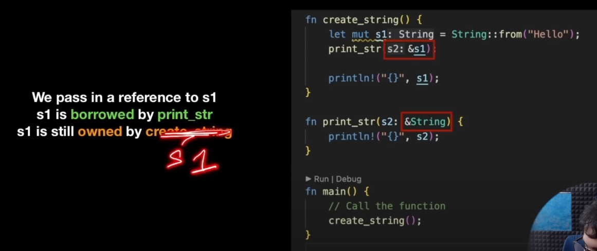


### Rules of References

- At any given time, you can have either one mutable reference or any number of immutable references.

- References must always be valid.


## Collections


## Vectors


### Iterating through a vector using for loop

```rust
for val in vec {
    if val % 2 == 0 {

    }
}
```

### Initialising Vectors using macros


### Defining the type of the vector as generic

## Hashmap


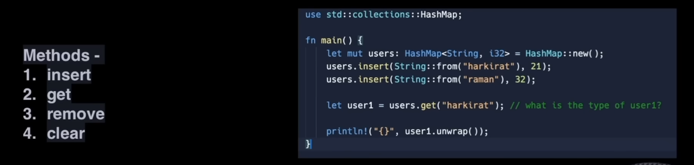

## Iterators


### Iterating using for loops


### Iterating after creating an iterator


> Iterator borrows the values with ```immutable references```, hence the original vector ```nums``` still owns these values.

### iter_mut()

```iter_mut()``` can be used to make ```mutable references``` to the original collection with the iterator.


### Iterating using .next


### into_iter()


### Which Iterator to choose?


Iterating directly on the collection with a for loop is same as using ```into_iter```, hence ownership is tranferred in both the cases.


### Types of Iterators

#### Consuming Adapters


#### Iterator Adapters


- Map


- Filter


## Strings vs slices


### Creating a string


### Mutating a string


### Deleting from a string

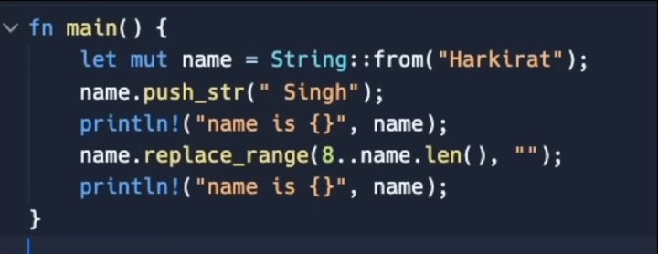

#### How string looks like in memory


> Slice doesn't have the ownership


#### String literal

The string literal is literally hard coded in the binary of the rust code.

The string literal is of type ```&str``` and it literally points to that literal in the binary.


## Generics


The main problem in the above code snippet is the ```redundancy```.

To solve this we use ```generics```.


> ```std::cmp::PartialOrd``` restricts values other than those that are comparable from being passed as arguments into the function.

## Traits

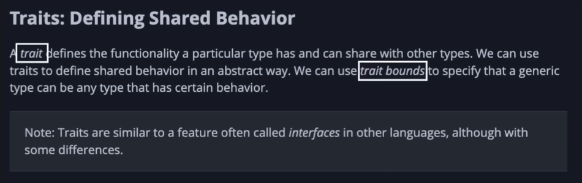

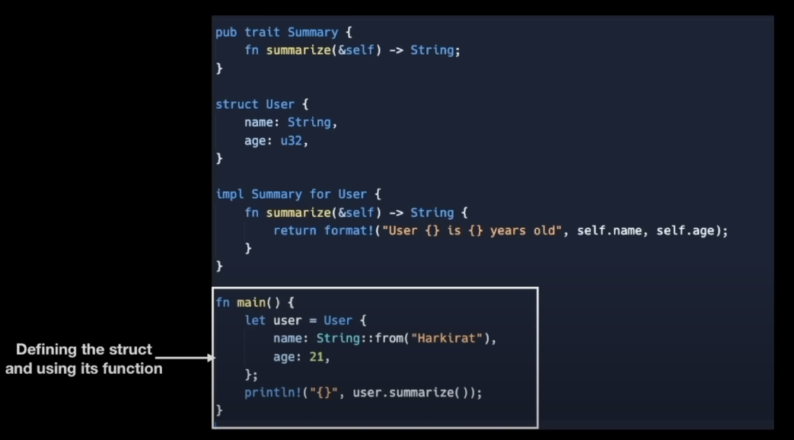

> Generally, the trait is defined with function signatures inside it. But, it can also be defined with default implementation, which can be used when the type that implements the trait doesn't have its own implementation.

### Default Implementations

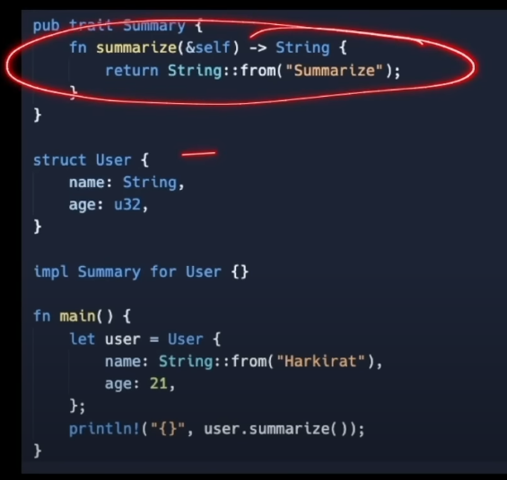

### Traits as Parameters

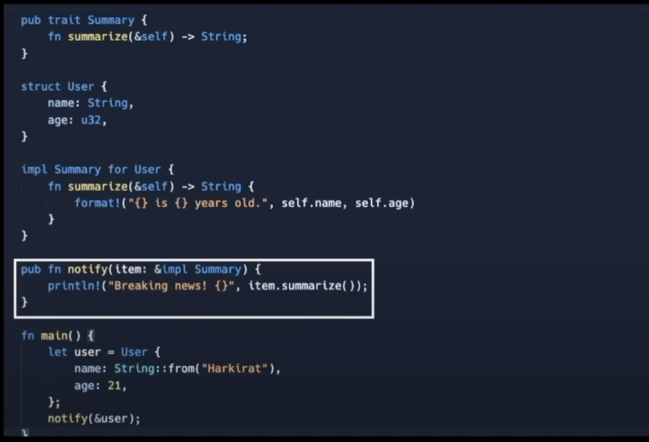

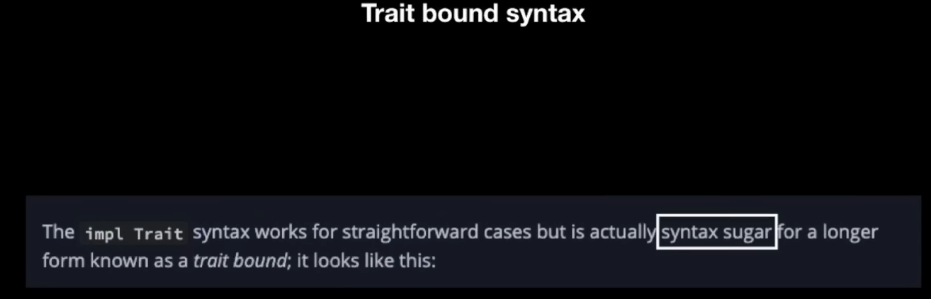

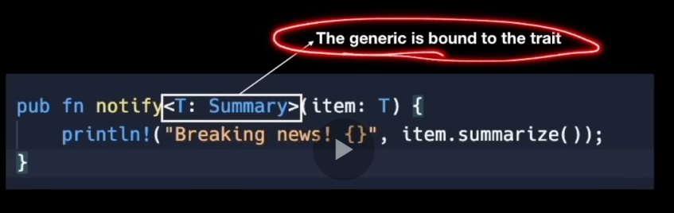


Since, the parameter can also have multiple trait bounds, even if one trait missed on the parameter, it can't be accepted as an argument.

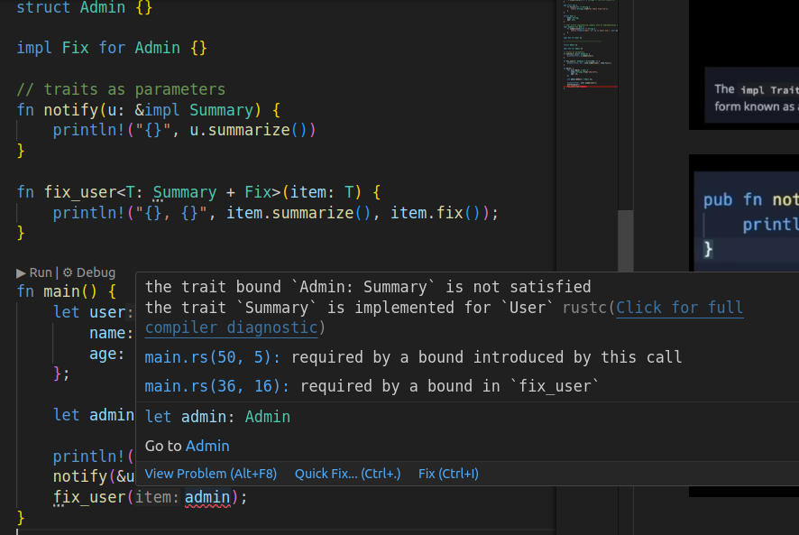

## Lifetimes

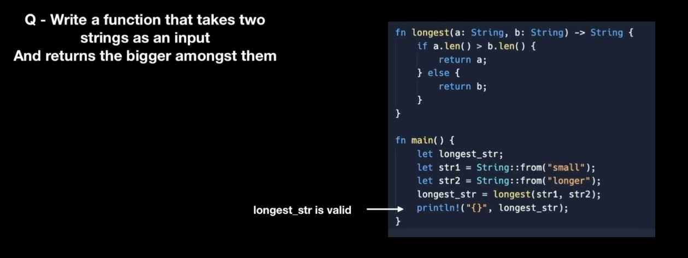

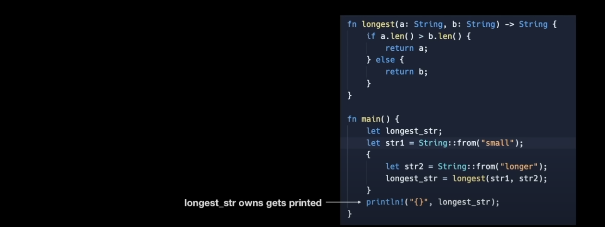

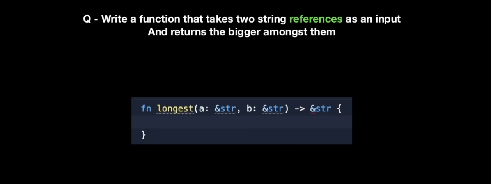

Passing references leads to ```dangling pointers``` when one of the strings goes out of the scope and is removed from the heap. (lifetime of one of the variables expires.)

Hence, Rust compiler warns beforehand that the lifetime of return value is not specified, since the lifetimes of the two variables are different and it is unknown which would be removed from the heap .i.e if they live long enough while being pointed by the return value.

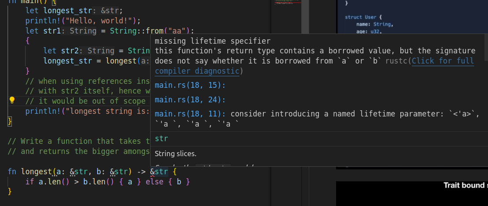

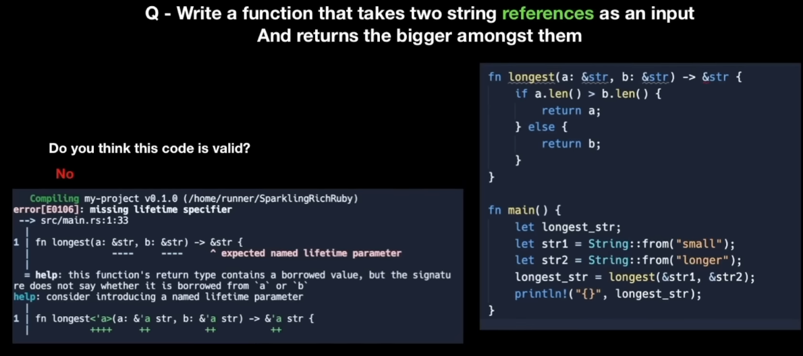

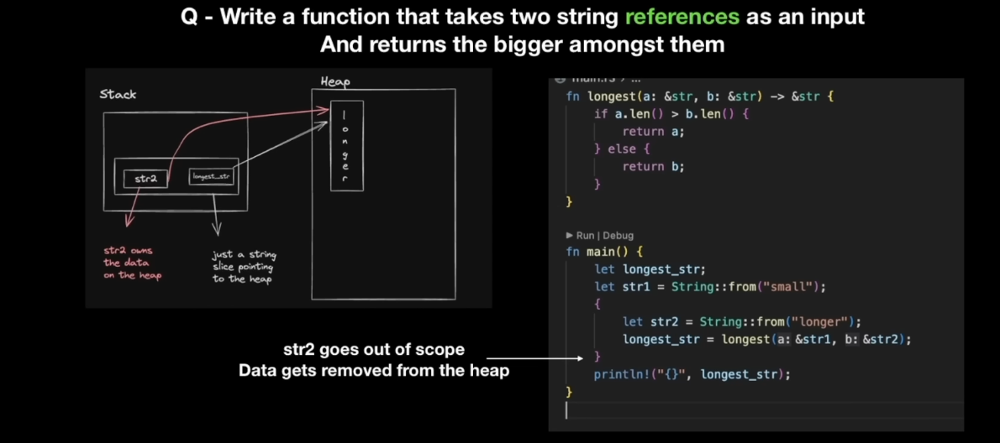

### Fixing the error using Generic Lifetime Annotation

Different values have different lifetimes.

Use ```Generic Lifetime annotations``` to communicate the relation b/w ```lifetimes``` of the ```input arguments``` and ```output arguments``` to the rust compiler. In this case, with ```same annotations``` for all the variables, **the lifetime of the return value would be the ```intersection``` of lifetimes of both the arguments** i.e. the return value would be valid until both the arguments are valid.

Thus, with these annotations, rust identifies that the return value doesn't have lifetime long enough to be access afterwards. Hence, throws an error.

Therefore, we can say that
> Generic Lifetime annotations are declared to establish a relationship b/w the lifetimes of the variables such that it enables Rust to identify if the references become invalid at some point (which leads to dangling pointers) and throw an error in such cases.

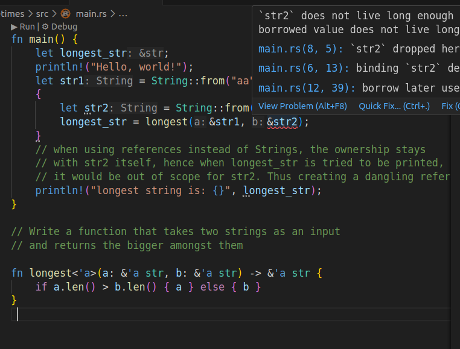

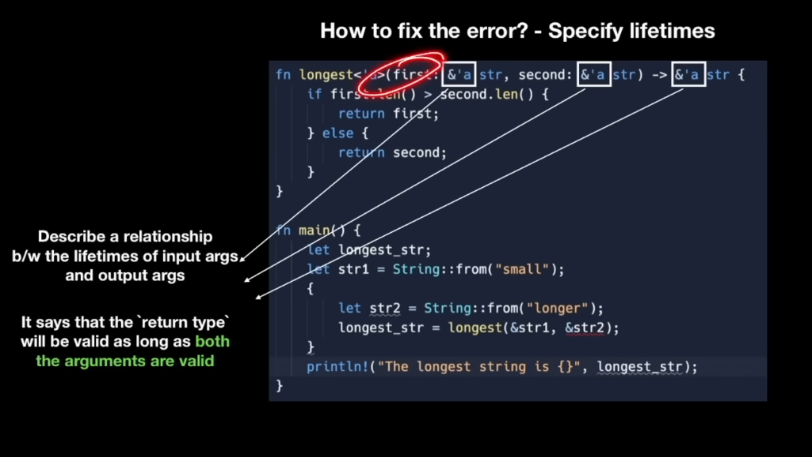

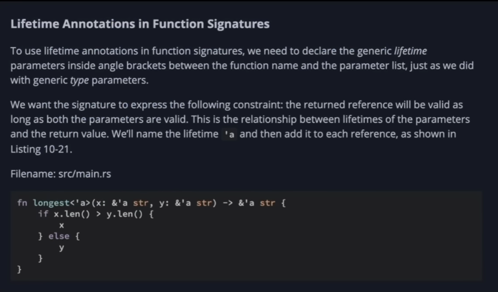

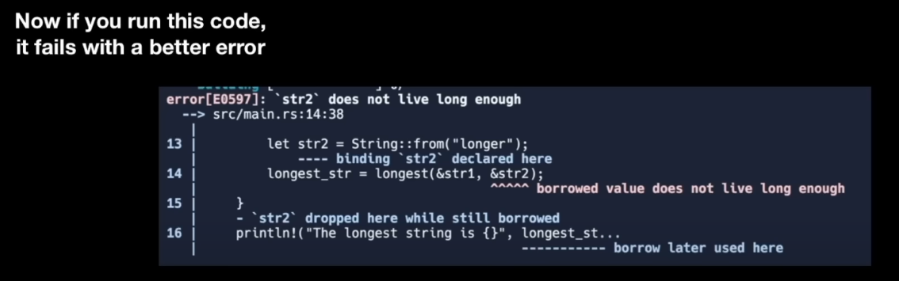

## Struct with lifetimes

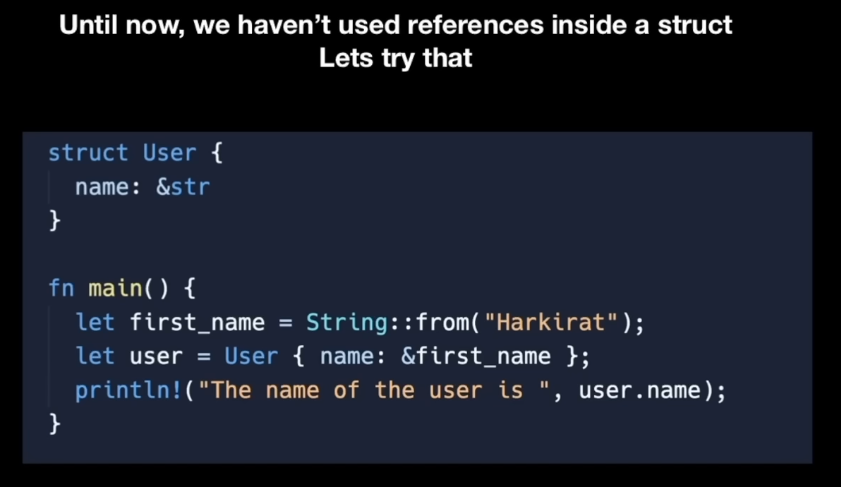

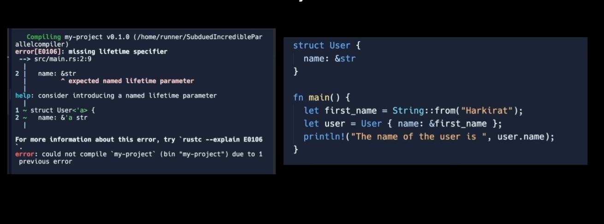

Here, We are passing a ```string reference``` as a value to one of struct properties instead of a ```String```.

> Hence, there should be a relationship b/w the lifetimes of the struct instance and the string reference, so that the compiler knows if the original string goes out of scope and whether the struct would become invalid.

Therefore, ````Generic lifetime annotations```` are used to relate the lifetimes of struct and string reference, such that struct lives only until the string reference lives.


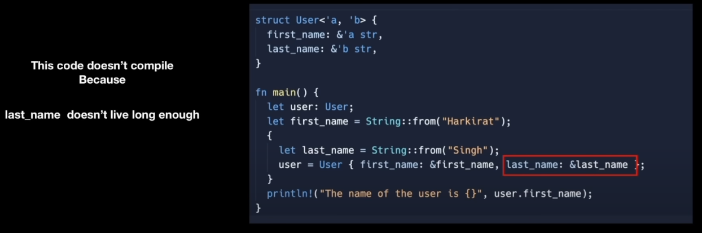

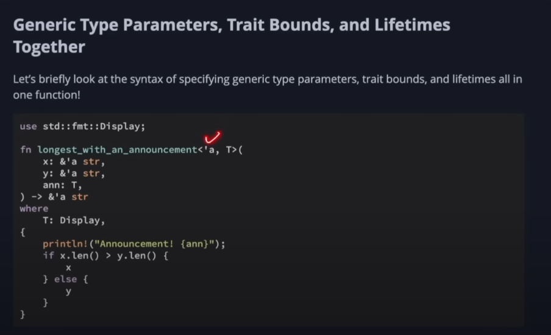
